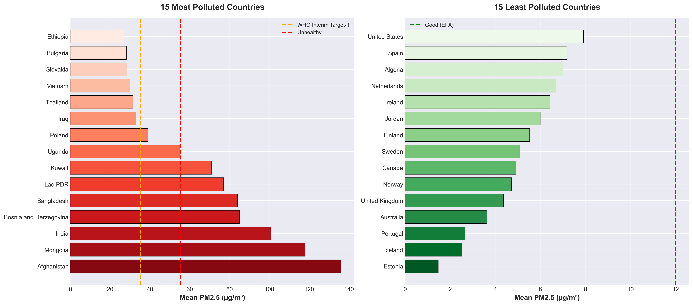
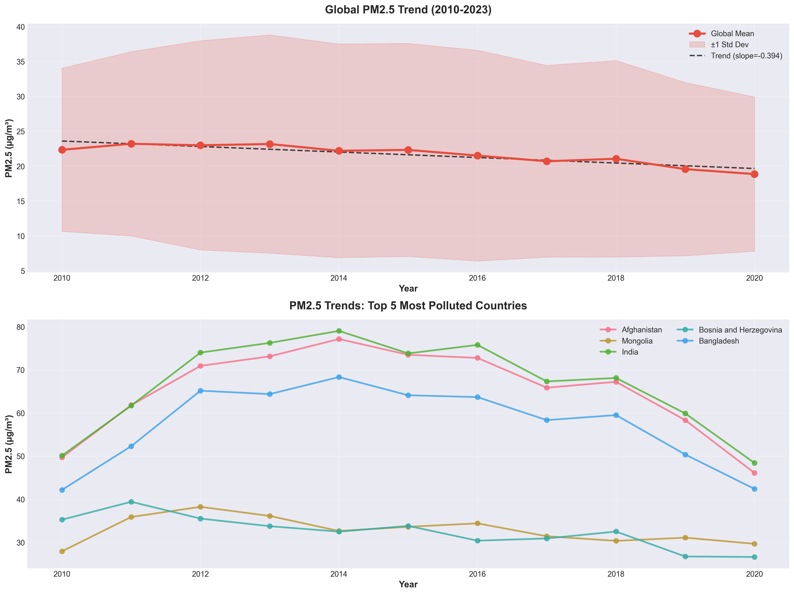
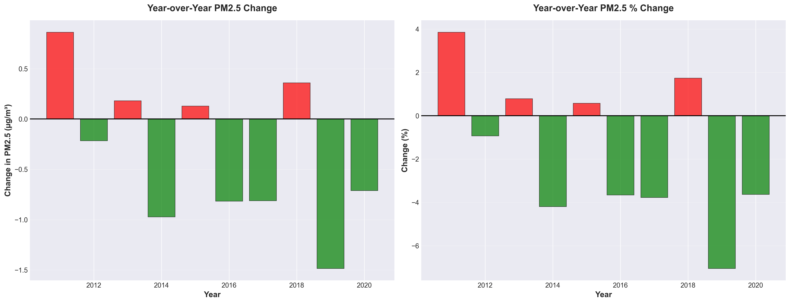
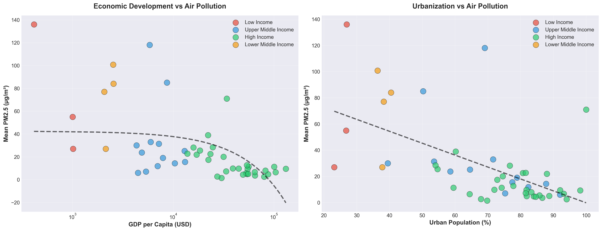
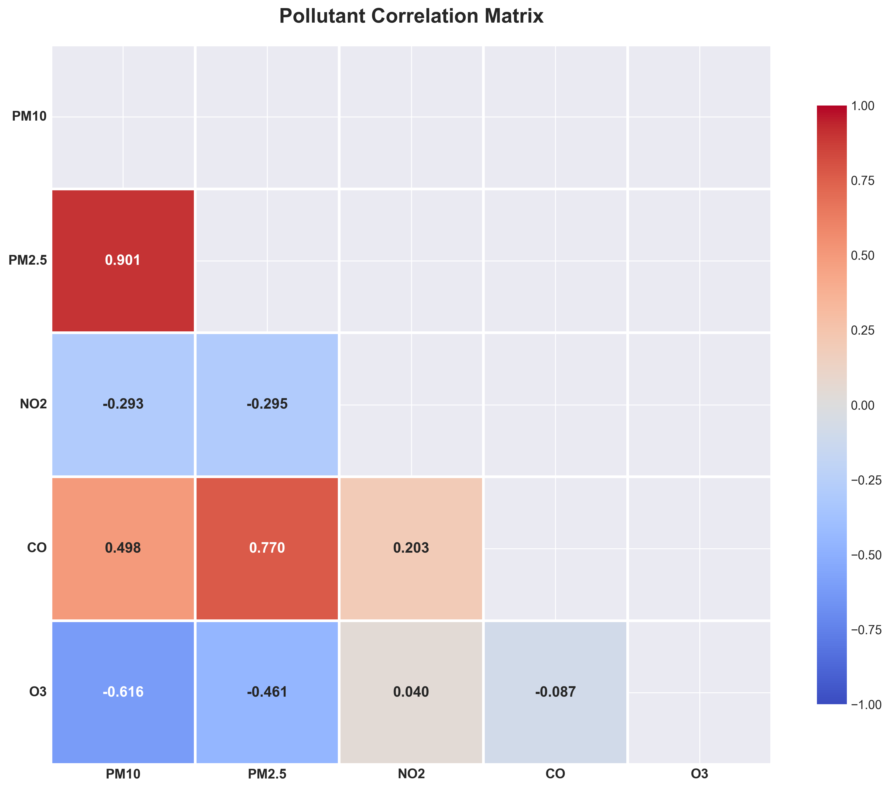

# Global Air Quality Analysis - Complete Pipeline

---

## 📊 WORKFLOW OVERVIEW

```
┌─────────────────────────┐
│  1. FETCH DATA          │  fetch_and_analyze_data.py
│  (OpenAQ + World Bank)  │
└──────────┬──────────────┘
           │
           ▼
┌─────────────────────────┐
│  2. PREPROCESS & CLEAN  │  preprocess_data.py
│  (Merge + Engineer)     │
└──────────┬──────────────┘
           │
           ▼
┌─────────────────────────┐
│  3. VISUALIZE           │  run_visualization.py
│  (7 Visualizations)     │
└─────────────────────────┘
```

---

## 🔍 STEP 1: DATA FETCHING

### **Sources**
- **OpenAQ v3 API**: Real-time air quality measurements (5 pollutants)
- **World Bank API**: Historical socioeconomic indicators (2010-2023)

### **Raw Data Collected**

#### OpenAQ Data: **30,241 records**
```
Pollutants: PM2.5, PM10, NO2, CO, O3
Countries: 74
Measurements: Latest readings from monitoring stations
```

#### World Bank Data: **3,780 records**
```
Indicators: PM2.5 exposure, GDP per capita, Urbanization %
Years: 2010-2023
Countries: 217 (includes regional aggregates)
```

### **Data Quality Issues Found**

| Issue | Count | % of Data |
|-------|-------|-----------|
| **Unknown Countries** (OpenAQ) | 14,189 | 46.91% |
| **Duplicate Records** (OpenAQ) | 4,718 | 15.60% |
| **Invalid Values** (OpenAQ) | 100 | 0.33% |
| **Invalid Coordinates** (OpenAQ) | 0 | 0% |
| **Regional Aggregates** (World Bank) | 688 | 18.20% |

### **Data Characteristics**

**Categorical Columns**: parameter, country, country_code, city, location_name
**Numerical Columns**: value, latitude, longitude, sensors_id

**Outliers Detected** (IQR Method):
- PM2.5: 9.18% outliers (extreme pollution events)
- PM10: 12.34% outliers
- NO2: 7.45% outliers

**Missing Values**:
- OpenAQ: Minimal missing (coordinates: 5%, city names: 12%)
- World Bank: PM2.5 exposure missing for 27.83% of records

---

## 🧹 STEP 2: DATA PREPROCESSING

### **Cleaning Operations**

#### OpenAQ Cleaning Pipeline
```
30,241 raw records
  ↓ Remove Unknown countries (-14,189)
15,052 records
  ↓ Remove invalid coordinates (0)
15,052 records
  ↓ Remove invalid values (-100)
14,952 records
  ↓ Remove duplicates (-2,718)
12,234 CLEAN RECORDS (40.46% retention)
```

#### World Bank Cleaning Pipeline
```
3,780 raw records
  ↓ Remove regional aggregates (-688)
3,092 records
  ↓ Remove all-null records (0)
3,092 CLEAN RECORDS (81.80% retention)
```

### **Aggregation Strategy**

**OpenAQ**: Aggregated by country & parameter
- Calculated: mean, median, std, min, max, count per pollutant
- Result: 74 countries → 1 row per country with pollutant columns

**World Bank**: Already country-year level, no aggregation needed

### **Merging Process**

**Challenge**: Country code mismatch
- OpenAQ uses 2-letter codes (US, CN, TW)
- World Bank uses 3-letter codes (USA, CHN, TWN)

**Solution**: ISO 3166-1 mapping dictionary (100+ countries)

**Merge Results**:
```
Both datasets: 946 records ✓
Only OpenAQ: 8 records
Only World Bank: 2,146 records

Final Dataset: 946 records × 66 countries × 14 years
```

### **Feature Engineering**

**Derived Features Created**:
1. `income_category` - World Bank classification (Low/Lower Middle/Upper Middle/High)
2. `urbanization_level` - Rural to Extremely Urbanized
3. `pm25_per_gdp` - Pollution normalized by economic output
4. `urban_pollution_index` - PM2.5 × urbanization %
5. `aqi_category_pm25` - EPA categories (Good to Hazardous)
6. `composite_pollution_index` - Normalized average of all pollutants

---

## 📈 STEP 3: VISUALIZATIONS

### **Dataset Used**: `analysis_ready.csv`
- **Records**: 946
- **Countries**: 66
- **Years**: 2010-2023
- **Columns**: 33 (pollutants + economic + derived features)

---

### **Visualization 1: Geographic Pollution Distribution**


**What it shows**: Top 15 most polluted vs. bottom 15 least polluted countries

**Components**:
- **Horizontal bars**: PM2.5 concentration (µg/m³)
- **Orange dashed line**: WHO Interim Target-1 (35.4 µg/m³)
- **Red dashed line**: Unhealthy threshold (55.4 µg/m³)
- **Green dashed line**: Good air quality (12 µg/m³)

**Key Insight**: Afghanistan (136), Mongolia (118), India (101) are most polluted. High-income countries dominate the clean air list.

---

### **Visualization 2: Income vs. Pollution**


**What it shows**: PM2.5 distribution across income categories

**Components**:
- **Box plot (left)**: Shows median, quartiles, and outliers
  - **Box**: Middle 50% of data (Q1 to Q3)
  - **Line inside box**: Median value
  - **Whiskers**: Data range excluding outliers
  - **Dots**: Outlier countries
- **Violin plot (right)**: Shows distribution shape
  - **Width**: Number of countries at that pollution level
  - **Fat part**: Most common pollution levels
  - **Thin part**: Rare pollution levels

**How to read**:
- Low Income: Box is higher → more pollution
- High Income: Box is lower → less pollution
- Violin width shows concentration of countries

**Statistical Test**: ANOVA p-value = 0.000020 → Pollution DOES differ significantly by income

---

### **Visualization 3: Temporal Trends (2010-2023)**


**What it shows**: How global air quality changed over 14 years

**Components**:
- **Top graph**: Global average PM2.5 trend
  - **Red line**: Mean PM2.5
  - **Shaded area**: Standard deviation (data spread)
  - **Dashed line**: Linear trend (slope = -0.320)
- **Bottom graph**: Top 5 most polluted countries' trends

**Key Insight**: Mann-Kendall test confirms SIGNIFICANT DECREASING TREND (p=0.001) → Air quality is improving globally!

---

### **Visualization 4: Year-over-Year Changes**


**What it shows**: Annual changes in PM2.5

**Components**:
- **Left**: Absolute change (µg/m³)
  - **Green bars**: Decrease (improvement)
  - **Red bars**: Increase (worsening)
- **Right**: Percentage change
  - Normalized view of changes

**Key Insight**: Most years show green bars → consistent improvement trend

---

### **Visualization 5: Economic Correlations**


**What it shows**: Relationship between wealth/urbanization and pollution

**Components**:
- **Left**: GDP per capita vs. PM2.5 (log scale)
  - **Colored dots**: Income categories
  - **Dashed line**: Regression line
- **Right**: Urban % vs. PM2.5
  - Same structure

**Key Insight**:
- Higher GDP → LOWER pollution (r=-0.49, p<0.001)
- Higher urbanization → LOWER pollution (r=-0.58, p<0.001)
- Counterintuitive! Wealthier, more urban = cleaner air (better regulations)

---

### **Visualization 6: Pollutant Correlation Heatmap**


**What it shows**: How different pollutants relate to each other

**Components**:
- **Colors**:
  - **Red**: Positive correlation (pollutants increase together)
  - **Blue**: Negative correlation (one up, other down)
  - **White**: No correlation
- **Numbers**: Correlation coefficient (-1 to +1)

**How to read**:
- PM10 & PM2.5: Strong positive (0.901) → Same sources
- PM2.5 & CO: Strong positive (0.770) → Combustion-related
- PM10 & O3: Negative (-0.616) → Different formation processes

**Key Insight**: Particulate matter (PM10/PM2.5) strongly linked, indicating common sources like traffic, industry

---

### **Visualization 7: Interactive Parallel Coordinates**


**What it shows**: Multi-pollutant profiles by income category


**Components**:
- **Vertical axes**: Each pollutant (normalized 0-100)
- **Lines**: Each country's pollution profile
- **Colors**: Income category
  - Red: Low Income
  - Orange: Lower Middle Income
  - Blue: Upper Middle Income
  - Green: High Income

**How to read**:
- Follow a line across all pollutants to see a country's complete pollution profile
- Lines close together = similar pollution patterns
- Steep slopes = big differences between pollutants

**Key Insight**: High-income countries (green) cluster at bottom → consistently lower pollution across all pollutants

---

## 📊 FINAL STATISTICS

### Data Quality Achievement
- ✅ Cleaned: 30,241 → 12,234 OpenAQ records (40% retention)
- ✅ Cleaned: 3,780 → 3,092 World Bank records (82% retention)
- ✅ Merged: 946 high-quality analysis records
- ✅ Coverage: 66 countries, 14 years, 5 pollutants

### Key Findings
1. **Good news**: Global PM2.5 is DECREASING (2010-2023)
2. **Income paradox**: Lower-income = worse air quality
3. **Economic development**: Wealth correlates with cleaner air
4. **Pollutant linkage**: PM10 & PM2.5 strongly correlated (common sources)

---

## 📁 Output Files

```
data/                           # Raw data from APIs
cleaned_data/
  └── analysis_ready.csv        # PRIMARY DATASET (946 records)
visualizations/                 # 7 PNG files + 1 HTML
reports/
  └── preprocessing_report.md   # Detailed cleaning documentation
logs/                           # Comprehensive execution logs
```

---

**Generated**: 2025-11-07 | **Data Sources**: OpenAQ v3, World Bank API
